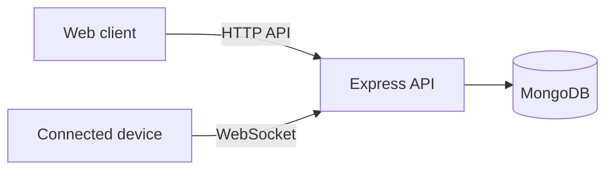

# HOptimum API

Backend for an integrated hotel-management prototype developed as a Computer Engineering capstone project.

The service connects hotel operations, authenticated clients, and connected devices through an HTTP API and WebSocket communication.

## Highlights

- REST API built with Express
- MongoDB persistence through Mongoose
- WebSocket communication for connected clients and devices
- Token-based authentication and a separate shared secret for device authentication
- Explicit liveness and readiness probes
- Controlled startup retries and graceful shutdown
- Destructive startup tasks disabled by default

## Architecture



The HTTP server starts first so orchestration platforms can query liveness. Functional routes remain unavailable until MongoDB and mandatory bootstrap tasks are ready.

## Tech stack

Node.js, Express, MongoDB, Mongoose, WebSocket (`ws`), ESLint

## Running locally

Requirements:

- A current Node.js LTS release
- A reachable MongoDB instance

```bash
git clone https://github.com/Esphios/HOptimumAPI.git
cd HOptimumAPI
npm install
cp .env.example .env
npm run lint
npm start
```

On Windows Command Prompt, replace the copy command with:

```bat
copy .env.example .env
```

Replace every placeholder in `.env` before starting the service. Never commit that file.

## Environment variables

| Variable | Purpose |
| --- | --- |
| `PORT` | HTTP port, defaulting to `3000` |
| `MONGODB_URI` | MongoDB connection string |
| `MONGODB_CONNECT_MAX_ATTEMPTS` | Maximum initial connection attempts |
| `MONGODB_CONNECT_RETRY_DELAY_MS` | Delay between initial connection attempts |
| `AUTH_TOKEN_SECRET` | Secret used to sign authentication tokens |
| `AUTH_TOKEN_TTL_MS` | Authentication-token lifetime in milliseconds |
| `ESP_SHARED_SECRET` | Shared secret required by device authentication |
| `ALLOW_DESTRUCTIVE_STARTUP_TASKS` | Enables destructive bootstrap tasks only when explicitly set to `true` |
| `ALLOWED_WS_ORIGINS` | Comma-separated WebSocket origin allowlist |
| `TZ` | Process timezone |

## Health checks

| Endpoint | Meaning |
| --- | --- |
| `GET /health/liveness` | The process is running |
| `GET /health/readiness` | MongoDB and mandatory bootstrap tasks are ready |

During bootstrap or a database outage, functional routes return `503 Service unavailable`.

## Quality commands

```bash
npm run lint
npm run smoke:startup
```

## Known limitations

- This is a capstone prototype, not a hosted production service.
- Automated coverage is currently limited to startup smoke validation.
- API reference documentation and an end-to-end demonstration are still pending.

## License

Licensed under the ISC License, as declared in `package.json`.
